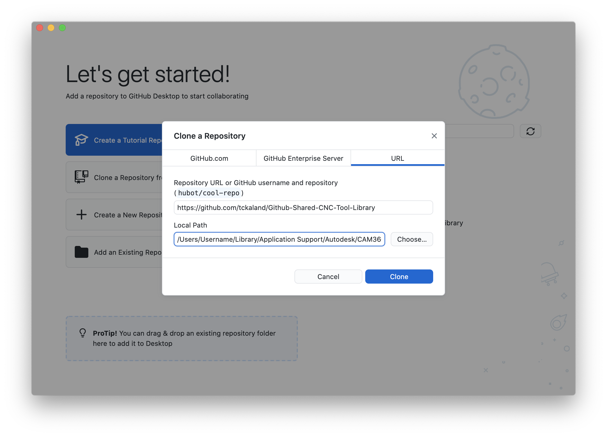
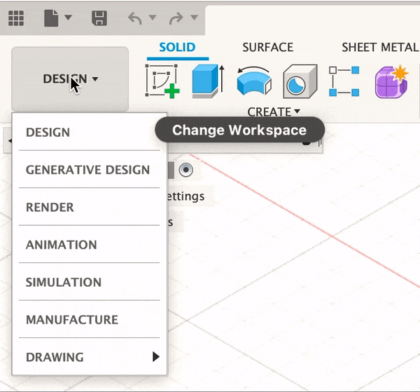
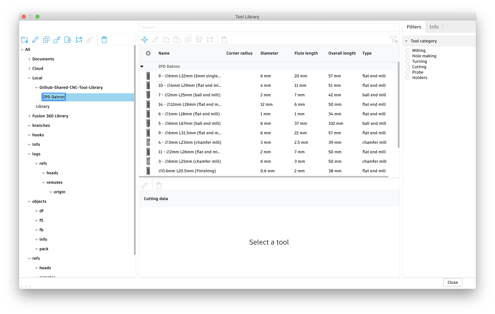
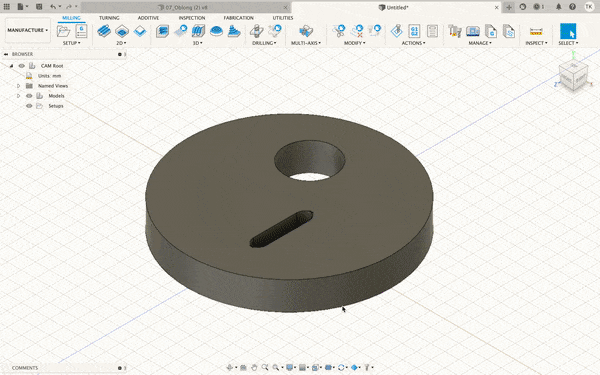
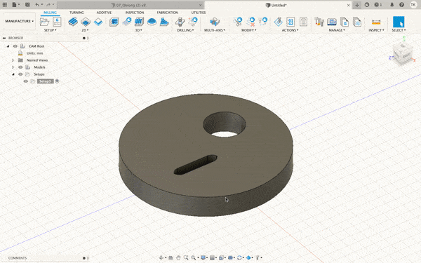

# Github-Shared-CNC-Tool-Library

### Hva er dette?

Hvis du vil kutte ut noe på CNC-maskinen på verkstedet, eller bare er *keen* på å lære deg å programmere CNC-maskinen igjennom Fusion360, så er dette plassen for deg! 

I GitHub-repoet finner du et stadig voksende bibliotek over verktøy som finnes til CNC-maskinen vår, med tilhørende forhåndsinnstillinger for hastighet og kuttedybde. I tillegg finner du en egen *postprosessor* til vår CNC (Datron M8 fra 2006) som gjør det enklere å bruke verktøy med manuellt skifte.

I readme-filen (filen du leser nå :astonished:) finner du også info om temaene under:

- [Hvordan importere verktøysbibliotek til Fusion360](#Hvordan-importere-verktøysbibliotek-til-fusion360)
- [Hvordan importere postprosessor til Fusion360](#Hvordan-importere-postprosessor-til-Fusion360)
- [Programmering av CNC-maskinen i Fusion360](#Programmering-av-CNC-maskinen-i-Fusion360)
- [Interne og eksterne verktøy](#Eksterne-og-interne-verktøy)
- [Oppstart av CNC-maskinen](#Oppstart-av-CNC-maskinen)
- [Manuell styring](#Manuell-styring)
- [Sette nullpunkt](#Sette-nullpunkt)
- [Lagre og laste inn nullpunkt](#Lagre-og-laste-inn-nullpunkt)
- [Skru av maskinen](#Skru-av-maskinen)

 

---

 

## Hvordan importere verktøysbibliotek til Fusion360

Verktøysbiblioteket er en liste over alle fresestålene (aka verktøyene) som vi har tilgjengelige for bruk i CNCen. Verktøysbiblioteket blir brukt når du skal sette opp operasjoner/programmere CNCen, hvor en da velger hvilke verktøy CNCen skal bruke til en bestemt operasjon. Verktøysbiblioteket inneholder info som diameter, antall kuttekanter, max kutt-dybde, hastighet, rotasjonshastighet og forhåndsinnstillinger for operasjoner som gjør det enklere å sette opp kutteoperasjoner og gjør du du kan simulere og sjekke om maskinen kommer til å kræsje eller ikke (veldig nyttig!). 

 

#### For Mac/OSX
###### Fremgangsmåte for windows kommer snart... :grimacing: 

 

1. Trykk på **Code** i GitHub på web og åpne repoet i **GitHub Desktop** (Eventuelt klon repoet til pcen din vha. https, ssh eller cli)
 <h6>:information_source:GitHub Desktop kan lastes ned **[her](https://desktop.github.com/)**</h6>

2. Lagre repoet i **DittBrukernavn/Library/Application Support/Autodesk/CAM360/libraries/Local**.
######          :bulb: Dersom Library mappen ikke vises i Finder, trykk **cmd + J** i Finder og huk av **Show Library Folder**

3. For å sjekke at biblioteket er importert, åpne Fusion360 og gå til CAM/Manufacture-arbeidsområdet.  

  Deretter trykk på dette 

 symbolet. Du burde nå ha fått opp et lignende vindu som vist under. :point_down:
 
 Verktøybiblioteket til CNCen på verkstedet vil ligge under **Local -> Github-Shared-CNC-Tool-Library -> IPD Datron**

4. Oppdater repoet med jevne mellomrom gjennom git for å holde verktøybiblioteket og *feeds & speeds* oppdatert. 
     Dersom du bruker GitHub Desktop, så gjøres dette enkelt ved å trykke på knappen "fetch origin".

### Alternativ måte
###### :warning: *Med denne måten så vil man ikke kunne oppdatere verktøybiblioteket igjennom git fortløpende*

1. Last ned repoen som en .zip og ekspander .zip-folderen.
2. Åpne Fusion 360, gå til **CAM/Manufature-arbeidsområdet** og trykk på  for å komme til *Tool Library*. 
3. Importer verkstedet sitt verktøysbibliotek for CNCmaskinen ved å trykke på importer  og velg **IPD Datron.json** som befinner seg i *.zip* filen du lastet ned fra GitHub.

 

---

 

## Hvordan importere postprosessor til Fusion360

Postprosessoren er en liten kodesnutt som oversetter kutteopreasjonene dine i Fusion360 til en Datron-spesifikk G-kode som vår CNCmaskin forstår. Uten postprosessoren vil ikke vår CNCmaskin forstå hva du har programmert i Fusion360. Postprosessoren gjør det også mulig å bruke flere verktøy enn det som står i det interne vektøymagasinet i CNCen.

#### For Mac/OSX
###### Fremgangsmåte for windows kommer snart... :grimacing: 

 

1. Du må først laste ned GitHub-repoet som vist i steg 1 og 2 i [Hvordan importere verktøysbibliotek til Fusion360](#Hvordan-importere-verktøysbibliotek-til-Fusion360).

2. Når repoet er lastet ned, åpne Fusion360, gå til *manufacture-arbeidsområdet* og trykk på *post library*  som ligger i *manage* fanen.

3. Trykk på Import-knappen  i fanen som kommer opp, og velg filen IPDDatronM8.cps som ligger i repoen/folderen som du lastet ned fra GitHub.
 
 <h6>:information_source: Dersom du har følgt fremgangsmåten som vist [her](#Hvordan-importere-verktøysbibliotek-til-Fusion360), så skal folderen ligge i **DittBrukernavn/Library/Application Support/Autodesk/CAM360/libraries/Local**</h6>

4. Ferdig! Postprosessoren for CNCen skal nå være tilgjengelig både i *Post Library* vinduet :point_down: og som en valgbar postprosessor når du trykker på *Post Process*  når du skal eksportere et CNCprogram.
 

 

---

 

## Programmering av CNC-maskinen i Fusion360

Okay, du har lastet ned og importert verktøysbiblioteket og postprosessoren til Fusion360, men hva nå? Hvordan går man fra en Fusion360fil til en fysisk modell? For å gå fra digital til fysisk modell så må du programmere inn hvordan modellen din ligger, definere et nullpunkt, generere baner som sier hvordan CNCen skal kutte vekk materiale og eksportere oppsettet og banene til noe CNCen forstår (aka G-kode).

#### Lage *setups*

 En *setup* forteller maskinen hvordan modellen din er plassert i CNCmaskinen. Dette innebærer bla. hva som er nullpunktet, hvor stor klump med materiale som du begynner med (aka *stock*) og hva som er X-, Y- og Z-aksen. Du kan lage flere setups for én modell, f.eks to setups med Z-akse vridd 180° for en tosidig maskinering.

Slik går du frem for å lage en *setup*:
1. I *manufacturearbeidsområdet, trykk på setupknappen  som ligger under setupfanen i menyen. Du burde nå få opp noe som ligner på dette :point_down:
 
 Her ser du hva som er *stock* (i gult) og hva som er nullpunkt og X-, Y-, og Z-akse i setupen (Blå, grøn og rød pil).

2. Dersom du har flere modeller i filen, gå på *model* og velg den modellen som du vil at setupen skal bruke som utgangspunkt for når den genererer kutteoperasjoner.

3. Velg hva som skal være nullpunkt og X-, Y-, og Z-akse i setupen. På vår CNC så peker Z-aksen oppover, X-aksen går fra venstre mot høyre og Y-aksen går fra helt fremme i maskinen og innover bak i maskinen. Du må altså velge X-, Y-, og Z-akse på modellen din slik at Z peker opp og X og Y peker til siden og bak.
    - For å overstyre orienteringen på modellen som automatisk blir satt, trykk på *orientation* under *Work Coordinate System (WCS)* og velg *select z axis/plane & x axis*. Velg deretter hva som skal være referansene for Z-aksen og X-aksen. Dersom aksene peker feil vei, huk av *flip axis* på den aksen som det gjelder.
    - For å velge hva som skal være nullpunkt i modellen din, trykk på *origin* og velg hva slags type nullpunkt du vil ha. Her kan du velge mellom *model origin*, *selected point*, *model box point* og *stock box point*. Som oftest så er det enklest og best å bruke *stock box point*. Deretter velger du hvor på *stocken* nullpunktet ditt skal være. Her er det som oftest enklest og best å velge det nederste venstre hjørnet som ligger på toppen av *stocken* din.
    -  Trykk på *stock-fanen* for å definere hvor stor *stock* du skal ha. Her er det igjen ganske mange forskjellige alternativer, men det funker ofte greit å bare velge *relative size box* og sette på et par millimeter *offset* på toppen og sidene av *stocken*.
4. Trykk på ok.

 

#### Legge til operasjoner

 Nå som en setup er laget så kan du begynne å lage og generere kutteoperasjoner! En kutteoperasjon er en generert "sti" som CNCmaskinen følger med en fres for å kutte vekk materiale som ikke er modellen din, slik at du ender opp med at kun modellen din står igjen. Den finnes mange forskjellige strategier for hvordan en kutteoperasjon skal oppføre seg, og det er normalt at man må lage flere kutteoperasjoner med forskjellige fresestørrelser og strategier for å lage et program som funker bra. 

Det å generere kutteoperasjoner er et veldig stort felt innen CNCmaskinering, og det er umilig å samle og forklare alt her. Det beste er å kikke på YouTube og å prøve seg frem for å lære seg og bli bedre på å lage kutteoperasjoner. Med det sagt, her er en generell fremgangsmåte:

1. Velg den *setupen* som skal få en ny kutteoperasjon.

2. Legg til en kurtteoperasjon ved å velge en strategi fra menybaren.
 
 Her kan du velge mellom mange forskjellige strategier, men de vanligste er *2D contour*, *Adaptive Clearing*, *Pocket Clearing*, *Horizontal* og *Face*. 
 <h6>:information_source: Hovre over de forksjellige strategiene i Fusion360 for å få en liten forklaring på hva de gjør.</h6>

3. Når du har valgt en type strategi å bruke så får du opp et vindu med masse variabler :point_down:
 
 Det første du må gjøre i dette vinduet er å velge et verktøy fra verktøysbiblioteket. Dette gjøres ved å trykke på *Select* under *tool* og velge det verktøyet du vil bruke i verktøysbibliotekvinduet som popper opp. Deretter kan du velge en *preset* under *feed & speed* eller skrive inn egne variabler. Det beste er å ta utgangspunkt i en *preset*, for så å forandre på de variablene som det trengs å forandre på. Her må du bare prøve deg frem!

4. Gå igjennom de forksjellige fanene og se og prøv deg frem med alle variablene som finnes der. To variabler å legge seg merke til er *stepdown* og *stepover*. *Stepdown* er hvor mye fresen skal dykke ned i materialet når den kutter, mens *stepover* er hvor mye fresen skal kutte på siden for hver gang den går over et område.  

5. Trykk på OK og vent til kutteoperasjoonen er generert ferdig. Dette kan ta litt tid hvis det er en stor eller avansert operasjon.

###### :information_source: For å generere en kutteoperasjon på  nytt, trykk på **cmd** + **G**.

 

#### Simulere kutting

 

#### Eksportere til G-kode

 

---

 

## Oppstart av CNC-maskinen

Her kommer det info snart. Jeg lover!

 

---

 

## Manuell styring

Her kommer det info snart. Jeg lover!

 

---

 

## Sette nullpunkt

Her kommer det info snart. Jeg lover!

 

---

 

## Lagre og laste inn nullpunkt

Her kommer det info snart. Jeg lover!

 

---

 

## Skru av maskinen